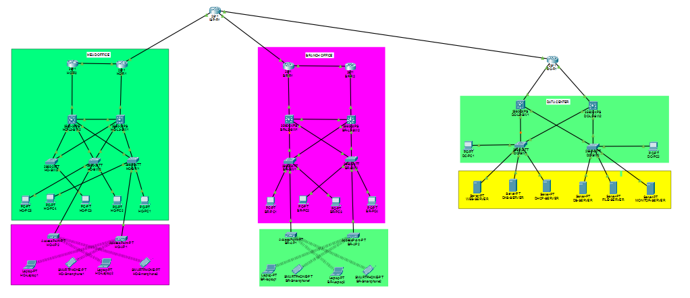

# Enterprise Network Automation Lab 

A Python-based enterprise network automation project designed to automate
Cisco network monitoring, health checks, configuration backups, OSPF
monitoring, and network reporting.

The project combines a multi-site Cisco enterprise network built in
Cisco Packet Tracer with Python-based automation using Netmiko.

---

## Project Overview

This project simulates a real-world enterprise network consisting of:

- Head Office
- Branch Office
- Data Center
- ISP / WAN Connectivity

The network contains Cisco routers, Layer 3 switches, access switches,
VLANs, wireless clients, enterprise servers, and routing infrastructure.

A Python automation layer is used to automate network management tasks
through SSH.

---

## Enterprise Network Topology



### Network Architecture

The enterprise network is divided into three major sites:

| Site | Main Components |
|---|---|
| Head Office | Routers, L3 switches, access switches, VLANs, wireless clients |
| Branch Office | Routers, L3 switches, access switches, VLANs, wireless clients |
| Data Center | L3 switches, enterprise servers, monitoring infrastructure |
| ISP | WAN connectivity between enterprise sites |

---

## Network Design

### Head Office

The Head Office contains:

- HQ-R1
- HQ-R2
- HQ-L3-SW1
- HQ-L3-SW2
- HQ-SW1
- HQ-SW2
- HQ-SW3
- Wireless Access Points
- PCs
- Laptops
- Smartphones

### Branch Office

The Branch Office contains:

- BR-R1
- BR-R2
- BR-L3-SW1
- BR-L3-SW2
- BR-SW1
- BR-SW2
- Wireless Access Points
- PCs
- Laptops
- Smartphones

### Data Center

The Data Center contains:

- DC-R1
- DC-L3-SW1
- DC-L3-SW2
- DC-SW1
- DC-SW2
- Web Server
- DNS Server
- DHCP Server
- Database Server
- File Server
- Monitoring Server
- Data Center PCs

### ISP

The ISP router provides WAN connectivity between:

- Head Office
- Branch Office
- Data Center

---

# Networking Technologies

The project uses the following networking technologies:

- IPv4 Addressing
- Subnetting
- VLANs
- Inter-VLAN Routing
- Router-on-a-Stick
- Layer 3 Switching
- OSPF
- HSRP
- STP
- DHCP
- DHCP Relay
- DNS
- HTTP
- SSH
- ACL
- Port Security
- Wireless Networking
- WAN Connectivity
- Network Troubleshooting

---

# Network Automation

The automation layer is developed using Python and Netmiko.

It is designed to communicate with Cisco IOS devices through SSH and
automate repetitive network administration tasks.

## Automation Architecture

```text
                    ENTERPRISE NETWORK
                           │
            ┌──────────────┼──────────────┐
            │              │              │
          HQ-R1        HQ-L3-SW1      HQ-L3-SW2
            │              │              │
            └──────────────┼──────────────┘
                           │
                          SSH
                           │
                           ▼
                  Python Automation
                           │
                    ┌──────┴──────┐
                    │   Netmiko   │
                    └──────┬──────┘
                           │
        ┌──────────────────┼──────────────────┐
        │                  │                  │
        ▼                  ▼                  ▼
   Health Check       Config Backup      Network Report
        │                  │                  │
        ▼                  ▼                  ▼
   Interface Data      Running Config     OSPF / Routes
        │                  │                  │
        └──────────────────┼──────────────────┘
                           ▼
                    Reports / Backups
